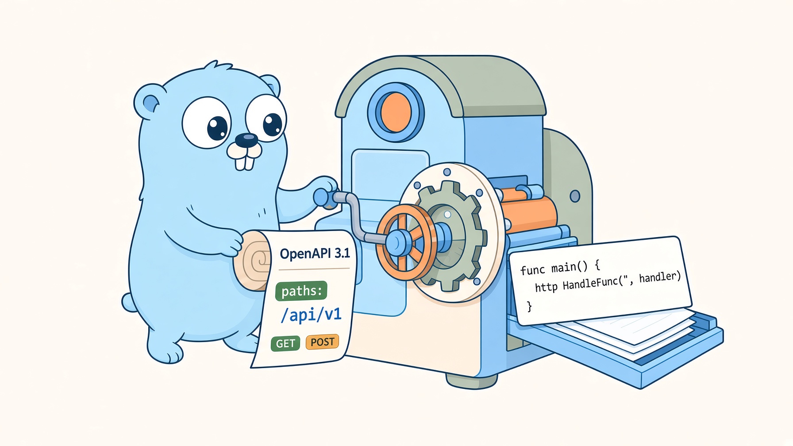

<!-- generated by MarkRosemaker/devtool — edit files in README/ instead. -->
[](https://pkg.go.dev/github.com/MarkRosemaker/openapi-codegen)  [](LICENSE)

<p align="center">
  
</p>

<h3 align="center">From API spec to Go code you'd have written yourself.</h3>

<div align="center" id=badges>


</div>


`openapi-codegen` parses an [OpenAPI 3.x](https://spec.openapis.org/oas/v3.1.0)
specification and generates idiomatic Go code — types, an HTTP client, an HTTP
server scaffold, and tests.

## Introduction

Generated code has a reputation for being obviously generated. This module tries
hard not to earn it: output is run through `goimports` and `gofumpt`, names are
converted to Go conventions rather than transliterated, and the emitted types are
the ones you would have declared by hand.

Getting there depends on the specification being in good shape first, which is why
this module doesn't work from the raw document. It normalizes the spec through the
rest of the family before generating anything:

1. **Load** the specification, and any recorded HTTP interactions
2. **Validate** it
3. **[Flatten](https://github.com/MarkRosemaker/openapi-flatten)** — every meaningful type gets a name, so it can become a named Go type
4. **[Compress](https://github.com/MarkRosemaker/openapi-compress)** — duplicate schemas collapse, so the same shape doesn't become five Go types
5. **Build an intermediate representation**, resolving schemas to Go types
6. **Match recorded interactions** to operations, for round-trip tests
7. **Render and format** the output

## Features

- **types** — structs, enums, and type aliases for all referenced schemas
- **client** — typed HTTP client with per-operation methods
- **server** — `http.Handler`-based server scaffold
- **tests** — round-trip and cassette-backed tests, generated from recorded traffic
- **JavaScript client** — optional `api.js` alongside the Go output

Identifiers are sanitized into valid, idiomatic Go: leading digits are spelled out,
punctuation is stripped, acronyms are preserved, and names that would collide with
the `error` interface or a Go keyword are renamed.

## Usage

```bash
go get -tool github.com/MarkRosemaker/openapi-codegen/cmd/openapi-codegen
```

or

```bash
go get github.com/MarkRosemaker/openapi-codegen
```


```sh
openapi-codegen -spec openapi.json -out ./gen -pkg mypkg -client
```

At least one of `-client`, `-server`, or `-js` is required. Types are generated
automatically whenever a client or server is, and client tests whenever a client is.

| Flag | Default | Purpose |
|---|---|---|
| `-spec` | `api/openapi.json` | Path to the OpenAPI specification |
| `-out` | `pkg/<package>` | Output directory for generated files |
| `-pkg` | directory name | Go package name |
| `-agent` | — | `User-Agent` string for the generated client |
| `-client` | `false` | Generate `client.gen.go` and `client.gen_test.go` |
| `-server` | `false` | Generate `server.gen.go` |
| `-js` | `false` | Generate `api.js` |

It can also be used as a library:

```go
import "github.com/MarkRosemaker/openapi-codegen"

err := codegen.Generate(codegen.Config{
    SpecPath:    "api/openapi.json",
    OutputDir:   "pkg/mypkg",
    PackageName: "mypkg",
})
```

`Config` accepts an already-parsed `*openapi.Document` instead of `SpecPath`, and an
`afero.Fs` instead of `OutputDir`, so generation can run entirely in memory.

## The openapi family

| Module | Purpose |
|---|---|
| [openapi](https://github.com/MarkRosemaker/openapi) | Parse, validate, and write OpenAPI 3.x specifications |
| [openapi-compare](https://github.com/MarkRosemaker/openapi-compare) | Compare specification objects — exact equality and shape equivalence |
| [openapi-edit](https://github.com/MarkRosemaker/openapi-edit) | Safe structural edits, such as renaming a schema and rewriting every `$ref` to it |
| [openapi-flatten](https://github.com/MarkRosemaker/openapi-flatten) | Promote inline definitions into named `components` entries |
| [openapi-compress](https://github.com/MarkRosemaker/openapi-compress) | Deduplicate and merge equivalent component schemas |
| [openapi-merge](https://github.com/MarkRosemaker/openapi-merge) | Merge schemas that were inferred independently from different samples |
| [openapi-enrich](https://github.com/MarkRosemaker/openapi-enrich) | Infer specification content from observed HTTP traffic |
| **openapi-codegen** (this module) | Generate Go types, clients, and servers from a specification |

This module sits at the end of the pipeline. If you have no specification to start
from, [`openapi-enrich`](https://github.com/MarkRosemaker/openapi-enrich) can build
one from recorded traffic — and the same recordings then become the generated
client's tests.

## Additional Information

- [**Go Reference**](https://pkg.go.dev/github.com/MarkRosemaker/openapi-codegen): API documentation.

## Contributing

Contributions are welcome — please open an issue or a pull request on [GitHub](https://github.com/MarkRosemaker/openapi-codegen).

## License

This project is licensed under the [Apache 2.0 License](./LICENSE).
