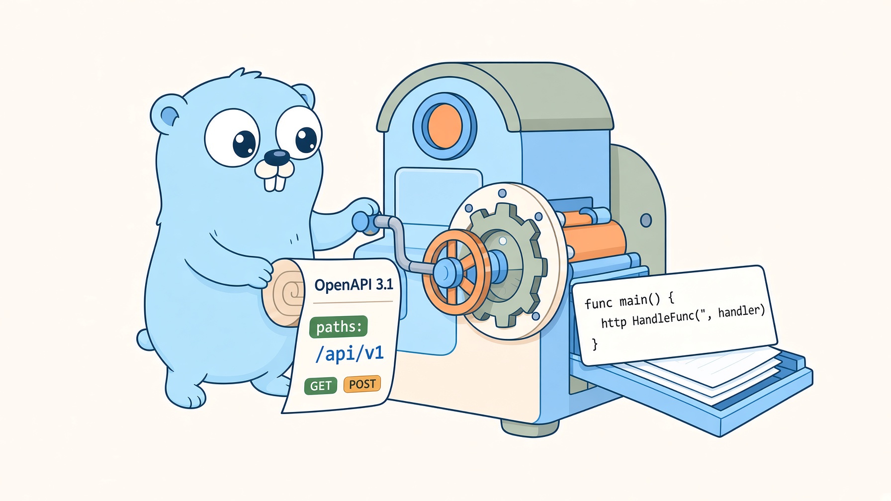

<!-- generated by MarkRosemaker/devtool — edit files in README/ instead. -->
[](https://pkg.go.dev/github.com/MarkRosemaker/openapi-codegen)  [](LICENSE)

<p align="center">
  
</p>

<h3 align="center">From API spec to Go code you'd have written yourself.</h3>

<div align="center" id=badges>


</div>


`openapi-codegen` parses an [OpenAPI 3.x](https://spec.openapis.org/oas/v3.1.0)
specification and generates idiomatic Go code — types, an HTTP client, an HTTP
server scaffold, and tests.

## Introduction

Generated code has a reputation for being obviously generated. This module tries
hard not to earn it: output is run through `goimports` and `gofumpt`, names are
converted to Go conventions rather than transliterated, and the emitted types are
the ones you would have declared by hand.

Getting there depends on the specification being in good shape first, which is why
this module doesn't work from the raw document. It normalizes the spec through the
rest of the family before generating anything:

1. **Load** the specification, and any recorded HTTP interactions
2. **Validate** it
3. **[Flatten](https://github.com/MarkRosemaker/openapi-flatten)** — every meaningful type gets a name, so it can become a named Go type
4. **[Compress](https://github.com/MarkRosemaker/openapi-compress)** — duplicate schemas collapse, so the same shape doesn't become five Go types
5. **Build an intermediate representation**, resolving schemas to Go types
6. **Match recorded interactions** to operations, for round-trip tests
7. **Render and format** the output

## Features

- **types** — structs, enums, and type aliases for all referenced schemas
- **client** — typed HTTP client with per-operation methods
- **server** — `http.Handler`-based server scaffold
- **tests** — round-trip and cassette-backed tests, generated from recorded traffic
- **JavaScript client** — optional `api.js` alongside the Go output

Identifiers are sanitized into valid, idiomatic Go: leading digits are spelled out,
punctuation is stripped, acronyms are preserved, and names that would collide with
the `error` interface or a Go keyword are renamed.

How the specification maps onto Go:

- **Unions** — a `oneOf` or `anyOf` becomes a struct with one field per
  alternative, exactly one (`oneOf`) or at least one (`anyOf`) of them set after
  decoding. A field is a pointer, nil until set, unless its zero value already
  says it is not set: nil for a slice or a map, `""` for a string. An alternative that is only `null` needs no field. Where a member tells
  the alternatives apart (the `discriminator`'s `propertyName`, or a member each
  alternative fixes to a string of its own, such as Notion's `type`), that member
  names the alternative. When it comes first, the alternative it names decodes
  each further member as it is read, without reading the whole value first;
  when it does not, the value is read whole and then decoded the same way. An
  unknown value, or a value without that member, is an error. An alternative that is a union of
  its own counts by its alternatives, however deep, so its leaves are chosen the same
  way. Encoding writes the discriminator first, with the value of the alternative
  set, and refuses a different one. Otherwise each alternative is tried in turn.
- **Tagged unions** — a union whose alternatives differ only in a tag, a member
  each fixes to a string of its own, and in at most one member named after that
  value, such as Notion's blocks (`{"type": "paragraph", "paragraph": {...}}`),
  becomes one struct instead: the members all alternatives share, the tag, and
  one optional field per alternative's member. Its methods check that only the
  member the tag names is set, and that it is where its alternative requires it,
  unless it can be `null`. Encoding with the tag left empty sends the value whose
  member is set. Alternatives that are unions tagged alike count by their own
  alternatives, and as part of an `allOf` the union's fields join the struct's.
  Alternatives nothing else refers to get no type of their own.
- **allOf** — each part referenced by this schema alone is folded into its fields;
  a part other schemas share stays an embedded type. A union among the parts is a
  field of its own, decoded by the struct's methods: the fields and the chosen
  alternative each take the members they declare, chosen by the discriminator or by
  which members are present, and a member none of them declares is an error.
- **Strictness** — decoding fails as soon as the input differs from what the
  specification allows, so that an incomplete specification shows itself. The
  generated methods report it as `encoding/json` does, with a `*json.SemanticError`
  locating it in the input; an unknown member wraps `json.ErrUnknownName`. A case
  that could be supported but has no real example yet, such as an `allOf` of two
  unions, is generated with methods that return an "unimplemented" error.
- **Debug mode** — with `-debug`, a client given `WithDebug` records each
  response it fails to decode to `api/interactions.json`, for `openapi-enrich` to
  learn from. Nothing the specification leaves open decodes into `any` then: the
  empty schema, an array without `items`, a free-form object and `not` alone
  become `struct{}`, so any value in them fails and is recorded.
- **Fields** — a field is a pointer only where its zero value must be told apart
  from something else: from leaving the field out, if it is optional, or from
  null, if it is nullable. That is a boolean, a number that may be 0, or an object
  that requires nothing, so `{}` says something; nil then leaves the field out,
  and a pointer to the zero value sends it. A zero value the specification makes
  the default, or rules out with a bound or an enum, needs no pointer. A string,
  a time, a slice, a map or a union is never a pointer: its zero value leaves it
  out. A struct that would contain itself refers to itself through a pointer.
- **Omitting** — an optional field is tagged `omitzero`, so it is left out while
  it holds its zero value: nil for a pointer, a slice or a map, so an empty one
  is still sent. A required field is always sent, `""`, `0` and `false`
  included.
- **Null** — a schema that is only ever `null` is `*struct{}`, and "X or null"
  is `X`, a pointer to `X` only by the rule for fields above, so that null and
  the zero value can differ.
- **Fixed parameters** — a required parameter that can take only one value, its
  `const` or the only value of its `enum`, is sent by the client itself: in the
  path, the query or the headers, such as Notion's `Notion-Version`. The caller
  never passes it. An `example` alone does not fix a value.
- **Query parameters** — an array is sent as one value per element (form style,
  exploded). "X or an array of X" is sent as the array, a union of strings as a
  string, and `null` is dropped, since a query string cannot carry it.
- **Authentication** — each operation sends the credential its own `security`
  names, else the document's: a bearer token or basic auth, read from the
  environment. Where a document uses both, `NewClient` requires at least one, and
  each operation fails before sending if its own is missing.
- **Success responses** — an operation returns its success body as `*T`, or as
  `T` where `T` is already nilable: a slice, a map, or a named type of either. An
  operation whose success body is an empty object returns just `error`, and the
  server writes `{}`. Its body is read only in debug mode, where it is decoded so
  that anything in it fails loudly and is recorded.
- **Binary responses** — a success body that is not text, such as a zip, a PDF,
  an image or a video, is returned as an `io.ReadCloser` that reads it as it
  arrives, never held whole in memory; the caller closes it. A text body that is
  not JSON is returned as `[]byte`. The server copies a returned reader into
  the response, and the JavaScript client returns such a body as a `Blob`, or
  text as a string.
- **Error responses** — an error body's type is returned wrapped in
  `api.Error`, so it needs an `Error() string` method. The generator does not
  write one, since a good message depends on the API: add it by hand beside the
  generated code.
- **Names** — a component's Go name is its `x-go-name`, or its key with any
  character a Go identifier cannot hold removed (`Keypoint-Input` →
  `KeypointInput`). Every type is exported: a key that does not begin with an
  upper-case letter is renamed in Go style first (`idRequest` → `IDRequest`,
  `error_api_400` → `ErrorAPI400`), with every reference to it. A name another
  component already holds is numbered (`date` beside `Date` → `Date2`); set
  `x-go-name` to choose a better one. A component that is only a `$ref`, only
  `null` or the empty schema declares no type; references to it use what it
  stands for.

## Usage

```bash
go get -tool github.com/MarkRosemaker/openapi-codegen/cmd/openapi-codegen
```

or

```bash
go get github.com/MarkRosemaker/openapi-codegen
```


```sh
openapi-codegen -spec openapi.json -out ./gen -pkg mypkg -client
```

At least one of `-client`, `-server`, or `-js` is required. Types are generated
automatically whenever a client or server is, and client tests whenever a client is.

| Flag | Default | Purpose |
|---|---|---|
| `-spec` | `api/openapi.json` | Path to the OpenAPI specification |
| `-out` | `pkg/<package>` | Output directory for generated files |
| `-pkg` | directory name | Go package name |
| `-agent` | — | `User-Agent` string for the generated client |
| `-client` | `false` | Generate `client.gen.go` and `client.gen_test.go` |
| `-server` | `false` | Generate `server.gen.go` |
| `-js` | `false` | Generate `api.js` |

It can also be used as a library:

```go
import "github.com/MarkRosemaker/openapi-codegen"

err := codegen.Generate(codegen.Config{
    SpecPath:    "api/openapi.json",
    OutputDir:   "pkg/mypkg",
    PackageName: "mypkg",
})
```

`Config` accepts an already-parsed `*openapi.Document` instead of `SpecPath`, and an
`afero.Fs` instead of `OutputDir`, so generation can run entirely in memory.

## The openapi family

| Module | Purpose |
|---|---|
| [openapi](https://github.com/MarkRosemaker/openapi) | Parse, validate, and write OpenAPI 3.x specifications |
| [openapi-compare](https://github.com/MarkRosemaker/openapi-compare) | Compare specification objects — exact equality and shape equivalence |
| [openapi-edit](https://github.com/MarkRosemaker/openapi-edit) | Safe structural edits, such as renaming a schema and rewriting every `$ref` to it |
| [openapi-flatten](https://github.com/MarkRosemaker/openapi-flatten) | Promote inline definitions into named `components` entries |
| [openapi-compress](https://github.com/MarkRosemaker/openapi-compress) | Deduplicate and merge equivalent component schemas |
| [openapi-merge](https://github.com/MarkRosemaker/openapi-merge) | Merge schemas that were inferred independently from different samples |
| [openapi-enrich](https://github.com/MarkRosemaker/openapi-enrich) | Infer specification content from observed HTTP traffic |
| **openapi-codegen** (this module) | Generate Go types, clients, and servers from a specification |

This module sits at the end of the pipeline. If you have no specification to start
from, [`openapi-enrich`](https://github.com/MarkRosemaker/openapi-enrich) can build
one from recorded traffic — and the same recordings then become the generated
client's tests.

## Additional Information

- [**Go Reference**](https://pkg.go.dev/github.com/MarkRosemaker/openapi-codegen): API documentation.
- [**Roadmap**](docs/roadmap.md): what is planned and not yet done.

## Contributing

Contributions are welcome — please open an issue or a pull request on [GitHub](https://github.com/MarkRosemaker/openapi-codegen).

## License

This project is licensed under the [Apache 2.0 License](./LICENSE).
