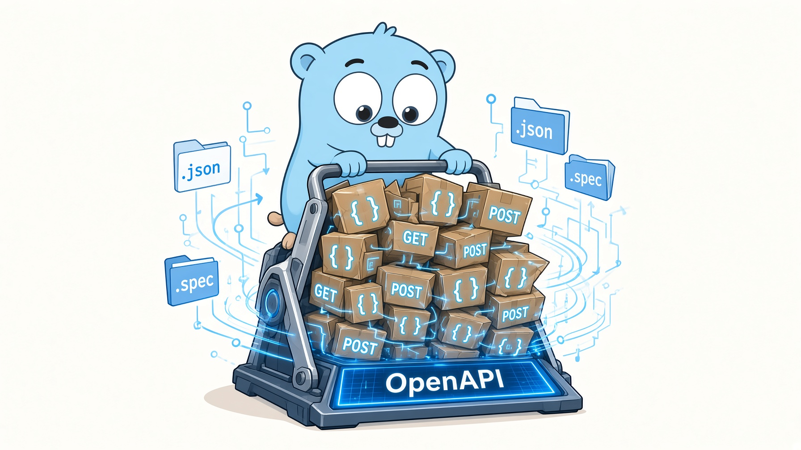

<!-- generated by MarkRosemaker/devtool — edit files in README/ instead. -->
[](https://pkg.go.dev/github.com/MarkRosemaker/openapi-compress)  [](LICENSE)

<p align="center">
  
</p>

<h3 align="center">One type, one name, one definition.</h3>

<div align="center" id=badges>


</div>


`openapi-compress` removes redundancy from an
[OpenAPI 3.x](https://spec.openapis.org/oas/v3.1.0) specification. It finds
component schemas that describe the same thing, merges them into one, rewrites every
`$ref` that pointed at the copies, and shortens the resulting names.

## Introduction

Specifications that are generated rather than hand-written accumulate duplicates
fast. The same object appears as a response body, as an array element, and as a
nested property, and each occurrence gets its own component with its own unwieldy
name — `GetV1PetByPetIDOkJSONResponseMedicalInfo` and
`ListV1PetsOkJSONResponseDataItemsMedicalInfo` describing an identical shape.

This module collapses them back down. Two schemas are considered the same when the
same JSON validates against both, using
[`openapi-compare`](https://github.com/MarkRosemaker/openapi-compare) — so schemas
that differ only in their `title` or `description` still merge, while a difference
that changes what the schema accepts prevents it.

Optionally it goes further, merging schemas that are merely *similar*: if two object
schemas share most of their properties, they can be widened into a single schema
covering both.

## Features

- **Deduplicates identical component schemas**, keeping one canonical definition
- **Merges similar schemas** above a configurable similarity threshold
- **Rewrites every `$ref`** throughout the document, including deep inside nested schemas
- **Deduplicates parameters** in the same way
- **Shortens the names** of merged schemas, dropping generated noise like `OkJSONResponse`

### How similarity works

At the default threshold of `1.0` only equivalent schemas merge. Below that, object
schemas are scored by a weighted Jaccard index over their property names:

```
score = Σ weight(p) / |union of property names|
```

where a property present in both with the same shape scores `1.0`, and one present
in both with a different shape scores `0.5`. The threshold steps down gradually,
running each level until no further merges are found, so the most confident merges
always happen first.

## Usage

```bash
go get -tool github.com/MarkRosemaker/openapi-compress/cmd/openapi-compress
```

or

```bash
go get github.com/MarkRosemaker/openapi-compress
```


```go
import (
    "github.com/MarkRosemaker/openapi"
    compress "github.com/MarkRosemaker/openapi-compress"
)

doc, err := openapi.LoadFromFile("api/openapi.json")
if err != nil {
    log.Fatal(err)
}

// Exact-shape deduplication only.
if err := compress.Document(doc, compress.Config{}); err != nil {
    log.Fatal(err)
}
```

To also merge schemas that merely overlap, lower the threshold:

```go
err := compress.Document(doc, compress.Config{
    MinSimilarity:  0.8,  // merge schemas sharing ≥80% of their properties
    SimilarityStep: 0.05, // step down by this much per round
})
```

| Field | Default | Purpose |
|---|---|---|
| `MinSimilarity` | `1.0` | Lowest similarity at which two schemas may merge. `1.0` means equivalent shapes only. |
| `SimilarityStep` | `0.05` | How far the threshold drops between rounds. |
| `SkipNameShortening` | `false` | Keep the original names instead of shortening merged ones. |

Renaming a schema on its own — without compressing anything — is
[`openapi-edit`](https://github.com/MarkRosemaker/openapi-edit)'s job, and this
module uses it internally to shorten the names of merged schemas:

```go
err := edit.RenameSchema(doc, "OldName", "NewName")
```

### Command line

```sh
openapi-compress -spec api/openapi.json -minsim 0.8
```

| Flag | Default | Purpose |
|---|---|---|
| `-spec` | `api/openapi.json` | Path to the specification, rewritten in place |
| `-minsim` | `1` | Minimum similarity for a merge |
| `-simstep` | `0.05` | Threshold reduction between rounds |

If the specification was valid on the way in, the result is validated before it is
written back.

## The openapi family

| Module | Purpose |
|---|---|
| [openapi](https://github.com/MarkRosemaker/openapi) | Parse, validate, and write OpenAPI 3.x specifications |
| [openapi-compare](https://github.com/MarkRosemaker/openapi-compare) | Compare specification objects — exact equality and shape equivalence |
| [openapi-edit](https://github.com/MarkRosemaker/openapi-edit) | Safe structural edits, such as renaming a schema and rewriting every `$ref` to it |
| [openapi-flatten](https://github.com/MarkRosemaker/openapi-flatten) | Promote inline definitions into named `components` entries |
| **openapi-compress** (this module) | Deduplicate and merge equivalent component schemas |
| [openapi-merge](https://github.com/MarkRosemaker/openapi-merge) | Merge schemas that were inferred independently from different samples |
| [openapi-enrich](https://github.com/MarkRosemaker/openapi-enrich) | Infer specification content from observed HTTP traffic |
| [openapi-codegen](https://github.com/MarkRosemaker/openapi-codegen) | Generate Go types, clients, and servers from a specification |

This module pairs naturally with
[`openapi-flatten`](https://github.com/MarkRosemaker/openapi-flatten): flattening
names every inline type, which necessarily creates duplicates, and compressing
collapses them again. Run flatten first.

## Additional Information

- [**Go Reference**](https://pkg.go.dev/github.com/MarkRosemaker/openapi-compress): API documentation.

## Contributing

Contributions are welcome — please open an issue or a pull request on [GitHub](https://github.com/MarkRosemaker/openapi-compress).

## License

This project is licensed under the [Apache 2.0 License](./LICENSE).
