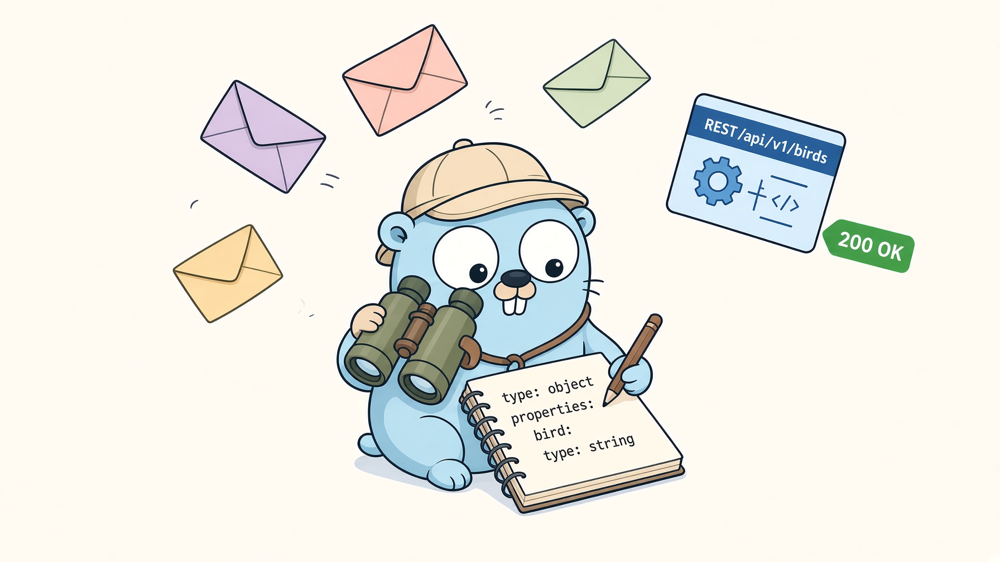

<!-- generated by MarkRosemaker/devtool — edit files in README/ instead. -->
[](https://pkg.go.dev/github.com/MarkRosemaker/openapi-enrich)  [](LICENSE)

<p align="center">
  
</p>

<h3 align="center">Build an API spec out of the traffic you already have.</h3>

<div align="center" id=badges>


</div>


`openapi-enrich` enriches an [OpenAPI 3.1](https://spec.openapis.org/oas/v3.1.0)
document from observed HTTP traffic. Feed it a document and a set of recorded
request/response pairs, and it adds the paths, operations, parameters, request
bodies, and response schemas it can infer from them.

## Introduction

Plenty of APIs have no specification, or one that stopped matching reality some time
ago. What they do have is traffic. This module treats that traffic as the source of
truth: record some real calls, and get a document describing what the API actually
does.

Enrichment is incremental by design. Every additional interaction refines the
result rather than replacing it — a second observation of the same endpoint
contributes any fields the first one didn't include, and widens a type where the two
disagree. That merging is delegated to
[`openapi-merge`](https://github.com/MarkRosemaker/openapi-merge), which exists
precisely for the problem of reconciling schemas inferred from independent samples.

## Features

What it infers:

- **Paths** — detected from request URLs, with ID-like segments replaced by
  `{param}` path parameters.
- **Operations** — one per unique method + path, with an inferred `operationId`
  (e.g. `GET /users` → `ListUsers`, `GET /users/{id}` → `GetUserByID`).
- **Query parameters** — schema inferred from values; comma-separated values
  become non-exploded arrays.
- **Request headers** — `Authorization` creates an HTTP security scheme;
  `x-*` and other custom headers become header parameters.
- **Request bodies** — JSON bodies produce inline object schemas.
- **Responses** — JSON, text/plain, and text/html responses are modeled;
  repeated observations are merged.
- **Schema formats** — UUID, URI, email, date-time, IPv4, IPv6 are detected
  automatically from string values.

The module also ships the pieces needed to *obtain* that traffic:

- `cassette` — self-contained HTTP interaction types, with JSON persistence,
  bearer-token masking, and header trimming before anything is written to disk.
- `recorder` — an `http.RoundTripper` that records live traffic into a cassette,
  so you can capture interactions by pointing an existing client at it.

## Usage

```bash
go get -tool github.com/MarkRosemaker/openapi-enrich/cmd/openapi-enrich
```

or

```bash
go get github.com/MarkRosemaker/openapi-enrich
```


```go
import (
    enrich "github.com/MarkRosemaker/openapi-enrich"
    "github.com/MarkRosemaker/openapi-enrich/cassette"
)

// Start from a minimal document or load an existing spec.
doc := enrich.NewDocument()

interactions := []cassette.Interaction{
    {
        Request: cassette.Request{
            Method:  "GET",
            URL:     "https://api.example.com/users",
            Headers: http.Header{},
        },
        Response: cassette.Response{
            StatusCode: http.StatusOK,
            Headers:    http.Header{"Content-Type": {"application/json"}},
            Body:       []byte(`[{"id":1,"name":"Alice"}]`),
        },
    },
}

if err := enrich.Enrich(doc, interactions); err != nil {
    log.Fatal(err)
}
```

The main public function is:

```go
func Enrich(doc *openapi.Document, interactions cassette.Interactions) error
```

Schemas are left inline — the caller composes any post-processing as needed.

## Design

- **No I/O** — the caller loads and saves the spec.
- **No flatten/tidy/sort** — use separate libraries for those.
- **Own interaction types** — no dependency on a specific HTTP recording format.

The result of enrichment is deliberately raw: inline schemas, unsorted, unpolished.
Turning that into something pleasant to read or generate from is the job of the
modules below, applied in whatever order suits you.

## The openapi family

| Module | Purpose |
|---|---|
| [openapi](https://github.com/MarkRosemaker/openapi) | Parse, validate, and write OpenAPI 3.x specifications |
| [openapi-compare](https://github.com/MarkRosemaker/openapi-compare) | Compare specification objects — exact equality and shape equivalence |
| [openapi-edit](https://github.com/MarkRosemaker/openapi-edit) | Safe structural edits, such as renaming a schema and rewriting every `$ref` to it |
| [openapi-flatten](https://github.com/MarkRosemaker/openapi-flatten) | Promote inline definitions into named `components` entries |
| [openapi-compress](https://github.com/MarkRosemaker/openapi-compress) | Deduplicate and merge equivalent component schemas |
| [openapi-merge](https://github.com/MarkRosemaker/openapi-merge) | Merge schemas that were inferred independently from different samples |
| **openapi-enrich** (this module) | Infer specification content from observed HTTP traffic |
| [openapi-codegen](https://github.com/MarkRosemaker/openapi-codegen) | Generate Go types, clients, and servers from a specification |

A common sequence is to enrich from traffic, flatten the inline schemas into named
components, compress the duplicates that flattening produces, and then generate a
client.

## Additional Information

- [**Go Reference**](https://pkg.go.dev/github.com/MarkRosemaker/openapi-enrich): API documentation.

## Contributing

Contributions are welcome — please open an issue or a pull request on [GitHub](https://github.com/MarkRosemaker/openapi-enrich).

## License

This project is licensed under the [Apache 2.0 License](./LICENSE).
