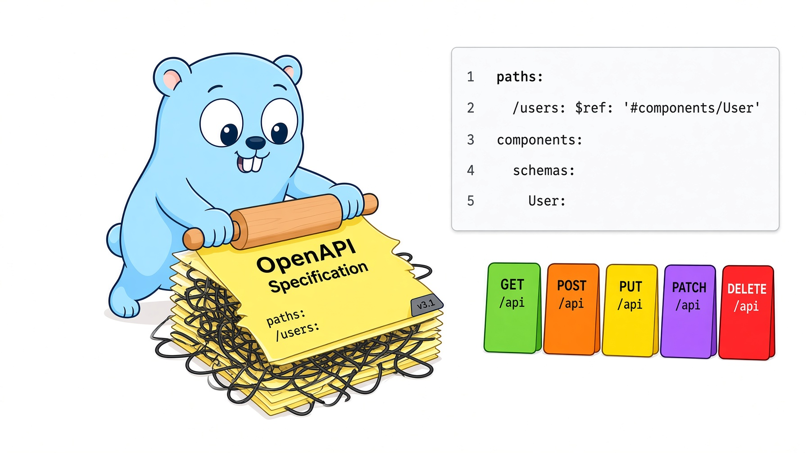

<!-- generated by MarkRosemaker/devtool — edit files in README/ instead. -->
[](https://pkg.go.dev/github.com/MarkRosemaker/openapi-flatten)  [](LICENSE)

<p align="center">
  
</p>

<h3 align="center">Give every type in your API spec a name and a home.</h3>

<div align="center" id=badges>


</div>


`openapi-flatten` eliminates nesting in [OpenAPI 3.x](https://spec.openapis.org/oas/v3.1.0)
specifications. It promotes inline schema definitions, responses, request bodies,
and parameters into the top-level `components` section and replaces them with `$ref`
references.

## Introduction

OpenAPI allows schemas to be defined inline anywhere they are used. While convenient
for small specs, deeply nested inline definitions make large specs harder to read,
harder to reuse, and harder to generate consistent client code from. Flattening
gives every meaningful type a name and a single canonical location.

This matters most upstream of code generation: a generator can only emit a named,
reusable Go type for a schema that *has* a name. Flattening first means
[`openapi-codegen`](https://github.com/MarkRosemaker/openapi-codegen) never has to
invent one.

## Features

- **Promotes inline schemas** to `components/schemas`, leaving simple scalars in place
- **Promotes responses, request bodies, and parameters** to their respective `components` sections
- **Generates readable PascalCase names** with automatic collision avoidance
- **Hoists shared parameters** common to every operation on a path up to the path item
- **Normalizes a common path prefix** (such as `/v1`) into the server URLs
- **Reports errors with the full JSON path** to the offending field

## Usage

```bash
go get -tool github.com/MarkRosemaker/openapi-flatten/cmd/openapi-flatten
```

or

```bash
go get github.com/MarkRosemaker/openapi-flatten
```


```go
import (
    "github.com/MarkRosemaker/openapi"
    flatten "github.com/MarkRosemaker/openapi-flatten"
)

// Load an OpenAPI document (JSON or YAML)
doc, err := openapi.LoadFromDataJSON(jsonBytes)
if err != nil {
    log.Fatal(err)
}

// Flatten all inline definitions
if err := flatten.Document(doc); err != nil {
    log.Fatal(err)
}

// doc now has no nested inline objects — only $ref pointers
```

`Document` is the entire public API. It modifies the document in place.

## What gets flattened

### Schemas

Inline schemas are moved to `components/schemas` when they contain meaningful structure. Simple scalar types (`integer`, `number`, `boolean`, plain `string`) stay inline to keep the spec readable. A schema is moved when it is:

- an **object** with properties
- a **string** or **array of strings** with `enum` values
- an **array of objects**

Schemas inside `allOf` are never moved because they exist solely to compose a larger type.

**Before:**

```json
{
  "paths": {
    "/pets": {
      "post": {
        "responses": {
          "400": {
            "content": {
              "application/json": {
                "schema": {
                  "type": "object",
                  "properties": {
                    "error": { "type": "string" }
                  }
                }
              }
            }
          }
        }
      }
    }
  }
}
```

**After:**

```json
{
  "paths": {
    "/pets": {
      "post": {
        "responses": {
          "400": {
            "$ref": "#/components/responses/CreatePetBadRequestResponse"
          }
        }
      }
    }
  },
  "components": {
    "responses": {
      "CreatePetBadRequestResponse": {
        "content": {
          "application/json": {
            "schema": {
              "$ref": "#/components/schemas/CreatePetBadRequestJsonResponse"
            }
          }
        }
      }
    },
    "schemas": {
      "CreatePetBadRequestJsonResponse": {
        "type": "object",
        "properties": {
          "error": { "type": "string" }
        }
      }
    }
  }
}
```

### Responses

Every inline response object is moved to `components/responses`. The generated name combines the operation ID, the HTTP status text, and the suffix `Response`:

```
{OperationID}{StatusText}Response
```

Examples: `CreatePetBadRequestResponse`, `GetMeUnauthorizedResponse`.

Error responses (status ≥ 400) always have their schemas promoted to components. Success responses only promote complex schemas.

### Request bodies

Inline request bodies are moved to `components/requestBodies`. The generated name is:

```
{OperationID}RequestBody
```

Example: `CreatePetRequestBody`.

### Parameters

Inline parameters are moved to `components/parameters` using the parameter's own `name` field.

Once flattened, parameters that appear on *every* operation of a path are hoisted up
to that path item's shared `parameters` list, and the per-operation copies removed.

### Common path prefix

If every path in the document begins with the same segment — a version prefix such
as `/v1`, for example — that segment is stripped from the path keys and appended to
each server URL instead. The effective URLs are unchanged; the paths just stop
repeating themselves.

## Name generation

All names are converted to Go-style PascalCase (e.g., `create pet bad request response` → `CreatePetBadRequestResponse`). If the generated name is already taken, a numeric suffix is appended (`Name2`, `Name3`, …) to avoid collisions.

## Error reporting

Errors include the full JSON path to the offending field, powered by [`errpath`](https://github.com/MarkRosemaker/errpath):

```
paths["/pets"].post.responses["400"]["application/json"].schema: unimplemented schema ref type "null"
```

## The openapi family

| Module | Purpose |
|---|---|
| [openapi](https://github.com/MarkRosemaker/openapi) | Parse, validate, and write OpenAPI 3.x specifications |
| [openapi-compare](https://github.com/MarkRosemaker/openapi-compare) | Compare specification objects — exact equality and shape equivalence |
| [openapi-edit](https://github.com/MarkRosemaker/openapi-edit) | Safe structural edits, such as renaming a schema and rewriting every `$ref` to it |
| **openapi-flatten** (this module) | Promote inline definitions into named `components` entries |
| [openapi-compress](https://github.com/MarkRosemaker/openapi-compress) | Deduplicate and merge equivalent component schemas |
| [openapi-merge](https://github.com/MarkRosemaker/openapi-merge) | Merge schemas that were inferred independently from different samples |
| [openapi-enrich](https://github.com/MarkRosemaker/openapi-enrich) | Infer specification content from observed HTTP traffic |
| [openapi-codegen](https://github.com/MarkRosemaker/openapi-codegen) | Generate Go types, clients, and servers from a specification |

Flattening naturally produces near-duplicate components, since the same shape
promoted from two places gets two names. Running
[`openapi-compress`](https://github.com/MarkRosemaker/openapi-compress) afterwards
collapses them again — the two are designed to be used in that order.

## Additional Information

- [**Go Reference**](https://pkg.go.dev/github.com/MarkRosemaker/openapi-flatten): API documentation.

## Contributing

Contributions are welcome — please open an issue or a pull request on [GitHub](https://github.com/MarkRosemaker/openapi-flatten).

## License

This project is licensed under the [Apache 2.0 License](./LICENSE).
