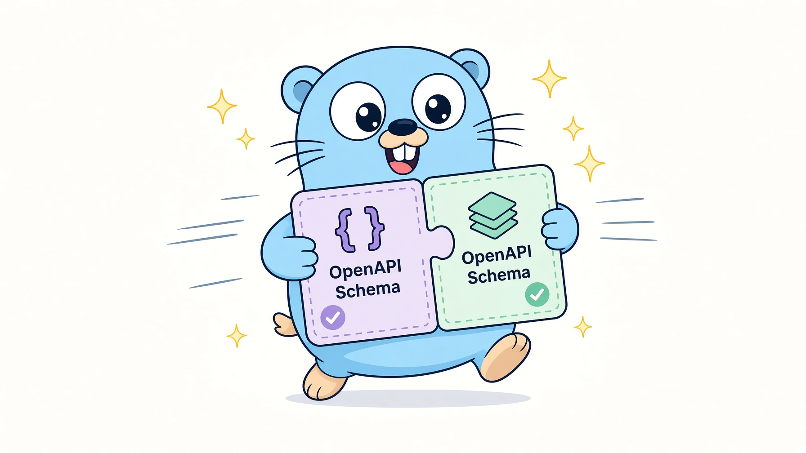

<!-- generated by MarkRosemaker/devtool — edit files in README/ instead. -->
[](https://pkg.go.dev/github.com/MarkRosemaker/openapi-merge)  [](LICENSE)

<p align="center">
  
</p>

<h3 align="center">Two views of the same endpoint, reconciled.</h3>

<div align="center" id=badges>


</div>


`openapi-merge` combines two [OpenAPI 3.x](https://spec.openapis.org/oas/v3.1.0)
objects into one that covers both. It exists for the problem of *incomplete
evidence*: when a schema is inferred from a sample of real data, each sample tells
you only part of the story, and the parts have to be reconciled.

## Introduction

Observe `GET /users/{id}` once and you might see `{"id": 1, "name": "Alice"}`.
Observe it again and you get `{"id": 2, "name": "Bob", "nickname": null}`. Neither
response is the schema. The schema is what you get by merging them: three
properties, one of them optional, one of them of unknown type.

That is what this module does. It is used by
[`openapi-enrich`](https://github.com/MarkRosemaker/openapi-enrich), which builds
specifications from recorded HTTP traffic and calls in here every time a second
observation of the same endpoint arrives.

Merging is destructive and asymmetric by design: `b` is merged **into** `a`, in
place. If the two cannot be reconciled, an error is returned describing the exact
JSON path at which they conflict.

## Features

Beyond combining properties and widening optionality, the merge handles the
particular ways that sample-derived schemas disagree:

- **Absent type information** — a value observed only as `null` carries no type, so
  the other side's type and format are adopted rather than treated as a conflict.
- **Numeric widening** — an integer in one sample and a floating-point number in
  another merge to a number.
- **Dates in two encodings** — a value seen as a date-time string in one sample and
  as a Unix timestamp integer in another becomes a `oneOf` of the two, rather than
  one silently discarding the other.
- **`oneOf` routing** — when one side already covers several shapes, the other is
  merged into whichever branch it matches.
- **Scalar-or-array parameters** — a parameter that appeared as a bare value in one
  sample and as an array in another merges the value into the array's item schema.
- **Enums** — an example value not yet present in an enum is added to it.

## Usage

```bash
go get github.com/MarkRosemaker/openapi-merge
```


```go
import (
    "github.com/MarkRosemaker/openapi"
    merge "github.com/MarkRosemaker/openapi-merge"
)

// b is merged into a; a is modified in place.
if err := merge.Schema(a, b, false); err != nil {
    log.Fatal(err) // e.g. properties["age"].type: "string" != "integer"
}
```

The final argument to `Schema` marks whether the schemas describe a *parameter*,
which enables the scalar-or-array reconciliation above — that mismatch is an
artifact of how query parameters get sampled, and applying it to a request body
would mask a genuine conflict.

Merging is available for each object kind:

| Function | Merges |
|---|---|
| `merge.Schema(a, b *openapi.Schema, isParam bool)` | Two schemas |
| `merge.SchemaRefs(a *openapi.SchemaRefs, b openapi.SchemaRefs)` | Two sets of named schemas |
| `merge.Parameter(a, b *openapi.Parameter)` | Two parameters |
| `merge.Response(a, b *openapi.Response)` | Two responses |
| `merge.MediaType(a, b *openapi.MediaType)` | Two media types |
| `merge.Content(a *openapi.Content, b openapi.Content)` | Two content maps |

Errors carry the full JSON path to the conflict, via
[`errpath`](https://github.com/MarkRosemaker/errpath).

## The openapi family

| Module | Purpose |
|---|---|
| [openapi](https://github.com/MarkRosemaker/openapi) | Parse, validate, and write OpenAPI 3.x specifications |
| [openapi-compare](https://github.com/MarkRosemaker/openapi-compare) | Compare specification objects — exact equality and shape equivalence |
| [openapi-edit](https://github.com/MarkRosemaker/openapi-edit) | Safe structural edits, such as renaming a schema and rewriting every `$ref` to it |
| [openapi-flatten](https://github.com/MarkRosemaker/openapi-flatten) | Promote inline definitions into named `components` entries |
| [openapi-compress](https://github.com/MarkRosemaker/openapi-compress) | Deduplicate and merge equivalent component schemas |
| **openapi-merge** (this module) | Merge schemas that were inferred independently from different samples |
| [openapi-enrich](https://github.com/MarkRosemaker/openapi-enrich) | Infer specification content from observed HTTP traffic |
| [openapi-codegen](https://github.com/MarkRosemaker/openapi-codegen) | Generate Go types, clients, and servers from a specification |

Two neighbours are easy to confuse with this one:

- [`openapi-compare`](https://github.com/MarkRosemaker/openapi-compare) *reports* on
  two objects without changing them. This module changes them.
- [`openapi-compress`](https://github.com/MarkRosemaker/openapi-compress) merges
  schemas too, but for a different reason — it collapses redundancy within a single
  finished document, whereas this module reconciles partial evidence about the same
  thing.

## Additional Information

- [**Go Reference**](https://pkg.go.dev/github.com/MarkRosemaker/openapi-merge): API documentation.

## Contributing

Contributions are welcome — please open an issue or a pull request on [GitHub](https://github.com/MarkRosemaker/openapi-merge).

## License

This project is licensed under the [Apache 2.0 License](./LICENSE).
