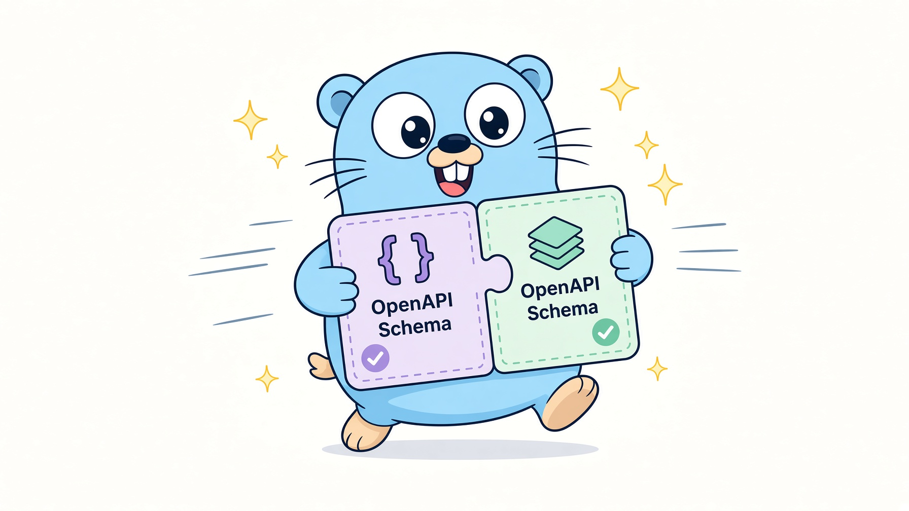

<!-- generated by MarkRosemaker/devtool — edit files in README/ instead. -->
[](https://pkg.go.dev/github.com/MarkRosemaker/openapi-merge)  [](LICENSE)

<p align="center">
  
</p>

<h3 align="center">Two views of the same endpoint, reconciled.</h3>

<div align="center" id=badges>


</div>


`openapi-merge` combines two [OpenAPI 3.x](https://spec.openapis.org/oas/v3.1.0)
objects into one that covers both. It exists for the problem of *incomplete
evidence*: when a schema is inferred from a sample of real data, each sample tells
you only part of the story, and the parts have to be reconciled.

## Introduction

Observe `GET /users/{id}` once and you might see `{"id": 1, "name": "Alice"}`.
Observe it again and you get `{"id": 2, "name": "Bob", "nickname": null}`. Neither
response is the schema. The schema is what you get by merging them: three
properties, one of them optional, one of them only ever seen as `null`.

That is what this module does. It is used by
[`openapi-enrich`](https://github.com/MarkRosemaker/openapi-enrich), which builds
specifications from recorded HTTP traffic and calls in here every time a second
observation of the same endpoint arrives.

Merging is destructive and asymmetric by design: `b` is merged **into** `a`, in
place. If the two cannot be reconciled, an error is returned describing the exact
JSON path at which they conflict.

## Features

Beyond combining properties and widening optionality, the merge handles the
particular ways that sample-derived schemas disagree:

- **Required** — an object requires only what both sides require: a value without
  a member makes it optional, as a recorded sample requires every member it has.
  What an inline `allOf` part requires is narrowed the same way.
- **Null** — a value observed only as `null` has the type `null`. Merged with a
  real type, the result is that type, made nullable (`["string", "null"]`), rather
  than a conflict.
- **Arrays only ever seen empty** — `{"type": "array", "maxItems": 0}` says nothing
  about the items, so the other side's items are adopted, and item bounds widen to
  cover both sides.
- **Tuples** — a tuple (`prefixItems`) merges position by position with a tuple of
  its length. A sample keeps no length, so a list whose item type fits every
  position, such as `[x, y, z]` recorded as a list of numbers, merges into each
  position too. Any other list or tuple becomes an alternative beside it in a
  `oneOf`, and later samples go to the alternative of their own shape, or add one.
- **Numeric widening** — an integer in one sample and a floating-point number in
  another merge to a number.
- **Dates in two encodings** — a value seen as a date-time string in one sample and
  as a Unix timestamp integer in another becomes a `oneOf` of the two, rather than
  one silently discarding the other.
- **Dates with and without a time** — a value seen as a `date` in one sample and
  as a `date-time` in another, as Notion's date `start` is, becomes a `oneOf` of
  the two.
- **Union routing** — when one side already covers several shapes, with `oneOf`
  or `anyOf`, the other is merged into whichever branch it matches. Of a tagged
  union's objects, the branch is the one whose pinned properties — a `const` or
  one-value `enum`, such as `"type": {"const": "select"}` — the sample has, so a
  sample never lands in a sibling's branch; of several that match, it is the one
  that declares the most of the sample's properties, so a full object wins over
  its partial form. Of branches that pin nothing, it is likewise the one that
  declares the most of the sample's properties, and, of those that declare as
  many, one whose required properties the sample has. With none that matches, the merge
  fails and names the values it got. A branch that is itself a union matches as
  its own branches do, an integer matches a number branch, and a string without
  a format matches when no branch has the sample's.
- **Samples** — a union marked `x-samples` (see `Samples`) holds samples of one
  value, such as the elements of a recorded array, not alternatives the value may
  take. Merged into a union, each sample goes into the branch it matches, so the
  elements of a list of mixed variants each reach their own; merged into a schema
  that is no union, each is merged into it in turn; merged into another union of
  samples, they join it, for the caller to collapse. Unlike `examples`, which
  hold values and stay in the specification, it holds schemas inferred from
  values and is only a working marker between the inference and the merge:
  openapi-enrich routes or collapses every one, so none reaches a finished
  specification.
- **Common properties beside a union** — an `allOf` of objects and one union
  takes each sampled property into the part that declares it, and the rest into
  the branch the whole sample matches.
- **Scalar-or-array parameters** — a parameter that appeared as a bare value in one
  sample and as an array in another merges the value into the array's item schema.
- **Enums** — an example value not yet present in an enum is added to it.

## Usage

```bash
go get github.com/MarkRosemaker/openapi-merge
```


```go
import (
    "github.com/MarkRosemaker/openapi"
    merge "github.com/MarkRosemaker/openapi-merge"
)

// b is merged into a; a is modified in place.
if err := merge.Schema(a, b, false); err != nil {
    log.Fatal(err) // e.g. properties["age"].type: "string" != "integer"
}
```

The final argument to `Schema` marks whether the schemas describe a *parameter*,
which enables the scalar-or-array reconciliation above — that mismatch is an
artifact of how query parameters get sampled, and applying it to a request body
would mask a genuine conflict.

Merging is available for each object kind:

| Function | Merges |
|---|---|
| `merge.Schema(a, b *openapi.Schema, isParam bool)` | Two schemas |
| `merge.SchemaRefs(a *openapi.SchemaRefs, b openapi.SchemaRefs)` | Two sets of named schemas |
| `merge.Parameter(a, b *openapi.Parameter)` | Two parameters |
| `merge.Response(a, b *openapi.Response)` | Two responses |
| `merge.MediaType(a, b *openapi.MediaType)` | Two media types |
| `merge.Content(a *openapi.Content, b openapi.Content)` | Two content maps |

Errors carry the full JSON path to the conflict, via
[`errpath`](https://github.com/MarkRosemaker/errpath).

## The openapi family

| Module | Purpose |
|---|---|
| [openapi](https://github.com/MarkRosemaker/openapi) | Parse, validate, and write OpenAPI 3.x specifications |
| [openapi-compare](https://github.com/MarkRosemaker/openapi-compare) | Compare specification objects — exact equality and shape equivalence |
| [openapi-edit](https://github.com/MarkRosemaker/openapi-edit) | Safe structural edits, such as renaming a schema and rewriting every `$ref` to it |
| [openapi-flatten](https://github.com/MarkRosemaker/openapi-flatten) | Promote inline definitions into named `components` entries |
| [openapi-compress](https://github.com/MarkRosemaker/openapi-compress) | Deduplicate and merge equivalent component schemas |
| **openapi-merge** (this module) | Merge schemas that were inferred independently from different samples |
| [openapi-enrich](https://github.com/MarkRosemaker/openapi-enrich) | Infer specification content from observed HTTP traffic |
| [openapi-codegen](https://github.com/MarkRosemaker/openapi-codegen) | Generate Go types, clients, and servers from a specification |

Two neighbours are easy to confuse with this one:

- [`openapi-compare`](https://github.com/MarkRosemaker/openapi-compare) *reports* on
  two objects without changing them. This module changes them.
- [`openapi-compress`](https://github.com/MarkRosemaker/openapi-compress) merges
  schemas too, but for a different reason — it collapses redundancy within a single
  finished document, whereas this module reconciles partial evidence about the same
  thing.

## Additional Information

- [**Go Reference**](https://pkg.go.dev/github.com/MarkRosemaker/openapi-merge): API documentation.

## Contributing

Contributions are welcome — please open an issue or a pull request on [GitHub](https://github.com/MarkRosemaker/openapi-merge).

## License

This project is licensed under the [Apache 2.0 License](./LICENSE).
